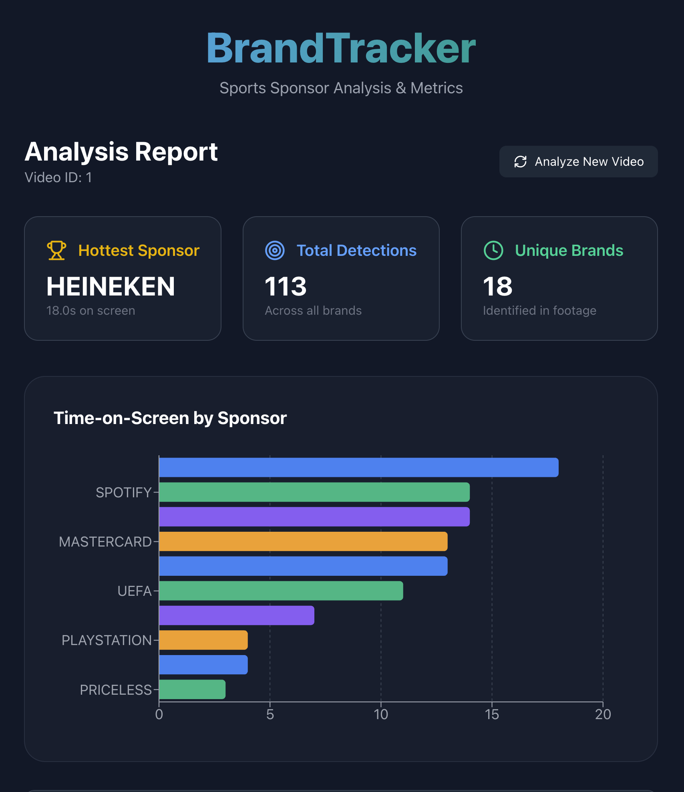

# BrandTracker

BrandTracker is a sports video analysis application that uses Google's Gemini Vision LLM to automatically detect and track sponsor logos in match footage. It provides detailed reports on "time-on-screen" and detection counts for each sponsor.



## Features

*   **Video Upload**: Upload local video files (MP4, MOV, etc.).
*   **YouTube Import**: Directly process YouTube videos via URL (using `yt-dlp`).
*   **AI-Powered Detection**: Utilizes **Google Gemini 2.0 Flash** for accurate, context-aware brand recognition.
*   **Smart Filtering**:
    *   **Prompt Engineering**: Filters out generic text (scoreboards, player names) to focus solely on commercial brands.
    *   **Fuzzy Matching**: Normalizes brand names to avoid duplicates (e.g., "FC Barcelona" matches "F.C. Barcelona").
*   **Interactive Dashboard**: Visualize top sponsors, view detection logs, and analyze exposure metrics.

## Tech Stack

*   **Backend**: Python, FastAPI, SQLAlchemy (SQLite), OpenCV, Google Generative AI (`google-generativeai`), `yt-dlp`, `thefuzz`.
*   **Frontend**: React (Vite), TailwindCSS, Recharts, Axios, Lucide React.
*   **AI Model**: Google Gemini 2.0 Flash.

## Prerequisites

*   Node.js (v16+)
*   Python (v3.10+)
*   Google Gemini API Key

## Setup & Running

1.  **Clone the repository**:
    ```bash
    git clone https://github.com/statscol/BrandTracker.git
    cd BrandTracker
    ```

2.  **Backend Setup**:
    ```bash
    cd backend
    pip install -r requirements.txt
    ```
    *   Set your API key:
        ```bash
        export GEMINI_API_KEY="your_api_key_here"
        ```
    *   Start the server:
        ```bash
        cd ..
        uvicorn backend.main:app --host 0.0.0.0 --port 8000
        ```

3.  **Frontend Setup**:
    ```bash
    cd frontend
    npm install
    npm run dev
    ```

4.  **Usage**:
    *   Open your browser at URL provided by Vite (usually `http://localhost:5173`).
    *   Upload a video or paste a YouTube link.
    *   View the analysis results on the dashboard.

## Docker Support (Recommended)

Run the entire application in isolated containers with a single command.

### 1. Set your API Key
You must set the `GEMINI_API_KEY` environment variable before running Docker.

```bash
export GEMINI_API_KEY="AIzaSy..." # Replace with your actual key
```

### 2. Run with Docker Compose
```bash
docker-compose up --build
```
This will start:
*   **Backend**: `http://localhost:8000`
*   **Frontend**: `http://localhost:5173`

Access the application at **[http://localhost:5173](http://localhost:5173)**.

## License

MIT
